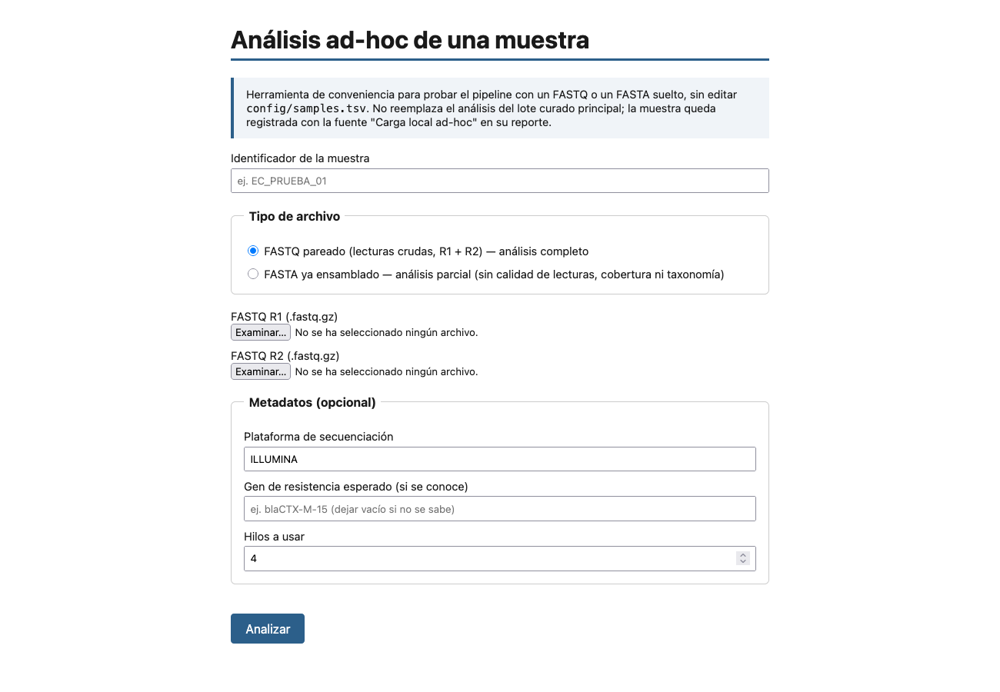
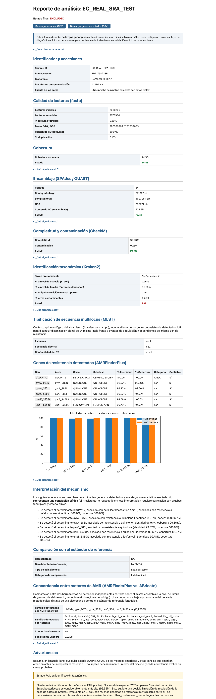

# Análisis de resultados — Arquitectura y producto final del sistema

> Versión navegable del reporte en Word (`docs/reporte_arquitectura.docx`). Describe el sistema construido; complementa al reporte de [validación estadística](../validacion_estadistica/reporte/analisis_resultados.md), que analiza su concordancia analítica.

El producto de este trabajo es un sistema de software funcional para la detección genotípica de resistencia a cefalosporinas de tercera generación en Escherichia coli. Tres piezas lo componen: un pipeline reproducible que encadena las herramientas bioinformáticas, una interfaz web para analizar una muestra suelta, y un contenedor que empaqueta todo para su distribución. Esta sección describe la arquitectura, las decisiones de diseño que sostienen su reproducibilidad, y los productos que el sistema entrega al usuario. Un caso real de ejecución —el aislado ERR17582235, descargado de ENA— sirve de hilo conductor.

## Arquitectura del sistema

El sistema sigue un diseño Python-first en el que cada lenguaje ocupa un rol acotado (Tabla 1). Python valida entradas, descarga y organiza archivos, invoca las herramientas externas, integra sus salidas y arma los reportes. Snakemake orquesta el flujo: cada regla declara sus entradas, salidas y comando, y el motor construye a partir de ellas un grafo dirigido acíclico que resuelve el orden de ejecución, paraleliza lo independiente y reanuda una corrida interrumpida sin repetir trabajo. R queda reservado para la estadística final. Ningún umbral vive dentro del código: la calidad mínima, los límites de ensamblaje, los cortes taxonómicos y de identidad se declaran en archivos de configuración YAML, de modo que ajustar el comportamiento no exige tocar los scripts.

**Tabla 1.** Roles de los componentes del sistema.

| Componente | Rol en el sistema |
| --- | --- |
| Python | Validación de entradas, descarga y organización, ejecución de herramientas, integración de resultados, generación de reportes y trazabilidad. |
| Snakemake | Orquestación del flujo como grafo dirigido acíclico: dependencias, paralelización y reanudación. |
| R | Análisis estadístico final (sensibilidad, especificidad, kappa, intervalos de confianza, coeficiente de variación). |
| Conda | Aislamiento de dependencias: un ambiente por herramienta, con versiones fijadas. |

## Flujo de procesamiento y herramientas

El pipeline encadena once etapas, cada una a cargo de una herramienta especializada y aislada en su propio ambiente (Tabla 2). El recorrido parte de las lecturas crudas y avanza por control de calidad, ensamblaje de novo, evaluación del ensamblaje, estimación de completitud, verificación de especie, detección de resistencia y tipificación, hasta converger en una tabla maestra y un reporte por muestra. La detección de resistencia se resuelve con dos motores independientes en lugar de uno, decisión de diseño que se retoma más abajo. La anotación estructural con Prokka existe como etapa disponible, pero no forma parte del recorrido por defecto.

**Tabla 2.** Etapas del pipeline, herramienta responsable y función.

| Etapa | Herramienta | Función |
| --- | --- | --- |
| Descarga | sra-tools | Obtención de lecturas desde SRA/ENA. |
| Control de calidad | fastp | Recorte de adaptadores y filtrado por calidad y longitud. |
| Ensamblaje | SPAdes | Ensamblaje de novo del genoma. |
| Evaluación de ensamblaje | QUAST | Métricas del ensamblaje (contigs, N50, longitud). |
| Completitud / contaminación | CheckM | Integridad del genoma ensamblado. |
| Verificación taxonómica | Kraken2 | Confirmación de la especie antes de interpretar resistencia. |
| Detección de resistencia | AMRFinderPlus + ABricate | Genes de resistencia, con dos motores independientes. |
| Tipificación (MLST) | mlst | Secuencia tipo, como contexto epidemiológico. |
| Anotación (opcional) | Prokka | Anotación estructural y funcional (fuera del flujo por defecto). |
| Estadística | R (caret, irr) | Métricas de concordancia de la validación. |
| Reporte | Python (Jinja2) | Reporte HTML autocontenido por muestra. |

## Decisiones de diseño para la reproducibilidad y la confianza

Varias decisiones transversales distinguen al sistema de un conjunto de scripts encadenados y sostienen las propiedades que una tesis de este tipo debe demostrar.

- **Aislamiento de dependencias.** Cada herramienta corre en su propio ambiente Conda con versiones fijadas. Se evita el conflicto real entre requisitos incompatibles (QUAST exige Python inferior a 3.12, por ejemplo) y se elimina la ambigüedad de "qué versión produjo este resultado".
- **Orquestación determinista y reanudable.** El grafo de dependencias de Snakemake fija el orden de ejecución a partir de los datos, no de un guion imperativo; una corrida interrumpida se retoma en el punto exacto en que quedó, sin rehacer lo ya calculado.
- **Trazabilidad.** El sistema registra la versión de cada herramienta, además de hashes y fechas de los archivos descargados, de modo que cualquier resultado puede rastrearse hasta su origen y su entorno de cómputo.
- **Doble motor de detección.** Los genes de resistencia se buscan con AMRFinderPlus y con ABricate de forma independiente; la concordancia entre ambos, resumida en el reporte, funciona como señal de alerta ante discrepancias en lugar de confiar en una sola fuente.
- **Controles de calidad explícitos.** Cada etapa emite un estado PASS, WARNING o FAIL con umbrales configurables. Ninguna muestra se descarta en silencio: un fallo queda visible y acompañado de su motivo, y la verificación de especie con Kraken2 antecede a cualquier interpretación de resistencia.

## La interfaz de usuario

La interfaz web es la vía de entrada para quien tiene una muestra suelta y quiere ver qué produce el sistema, sin editar tablas de configuración ni invocar Snakemake a mano (Figura 1). El formulario acepta dos tipos de entrada: un par de archivos FASTQ de lecturas crudas, que dispara el análisis completo, o un FASTA ya ensamblado, que corre un análisis parcial sin las etapas de calidad de lecturas, cobertura ni taxonomía dependiente de lecturas. Unos metadatos opcionales —plataforma de secuenciación, gen de resistencia esperado, número de hilos— afinan la ejecución y el reporte. Cada carga queda registrada como una corrida independiente y no interfiere con el lote curado principal.

*__Figura 1.__ Formulario de la interfaz web: identificador de la muestra, tipo de entrada (FASTQ pareado o FASTA ensamblado) y metadatos opcionales.*

## El reporte por muestra

El producto que el usuario recibe por cada muestra es un reporte HTML autocontenido (Figura 2). Sobre el aislado ERR17582235, el reporte encadena la identificación y procedencia; la calidad de las lecturas (2 086 206 lecturas iniciales, 50.97 % de GC); la cobertura estimada (61.35×, estado PASS); las métricas del ensamblaje (54 contigs, N50 de 296 271 pb, PASS); la completitud y contaminación por CheckM (99.93 % y 0.26 %, PASS); la verificación taxonómica por Kraken2; la secuencia tipo (MLST); y los genes de resistencia detectados, presentados como tabla —con identidad, cobertura y clase de cada gen— y como gráfica. Sobre esta muestra, el pipeline identificó blaCMY-2 (β-lactamasa tipo AmpC) junto a determinantes de resistencia a quinolonas y fosfomicina. El reporte cierra con la interpretación del mecanismo, la comparación contra el estándar de referencia, la concordancia entre los dos motores de AMR y un bloque de advertencias en lenguaje llano. Cada valor viaja con su estado de control de calidad, y una nota destacada recuerda que el informe describe determinantes genotípicos, nunca una conclusión clínica.

*__Figura 2.__ Reporte HTML generado para el aislado ERR17582235, con sus secciones de calidad, ensamblaje, taxonomía, tipificación y detección de resistencia.*

## Empaquetado y distribución

Reproducir el sistema desde cero exige instalar doce herramientas con sus dependencias, un obstáculo real para quien solo quiere usarlo. El contenedor Docker resuelve ese costo: una sola imagen trae Snakemake, la interfaz web y los doce ambientes Conda ya construidos, de modo que un usuario con Docker levanta la interfaz o corre el pipeline con un puñado de comandos, sin instalar nada más. Las bases de datos de referencia grandes (Kraken2, CheckM) se montan como volumen para no inflar la imagen, mientras que la base compacta de AMRFinderPlus viaja dentro de ella. La imagen se construye para la arquitectura linux/amd64, lo que elimina la fricción de las herramientas de Bioconda en equipos con chip Apple.

## Desempeño computacional

Sobre las muestras de control, el procesamiento completo de un genoma tomó del orden de 750 segundos, con un pico de memoria cercano a los 11 GB concentrado en el paso de colocación filogenética de CheckM. El tiempo de cómputo se mostró estable entre corridas repetidas (coeficiente de variación del 4 %), y el consumo de memoria pico algo más sensible a la carga del equipo (detalle en el reporte de validación estadística). La imagen del contenedor ocupa alrededor de 17.6 GB, dominada por los ambientes de las herramientas.

---

El resultado no es un análisis puntual sino un sistema reproducible y distribuible: los mismos datos y la misma configuración producen el mismo resultado, cada resultado es rastreable hasta su origen, y un tercero puede ejecutarlo sin reconstruir el entorno a mano.
