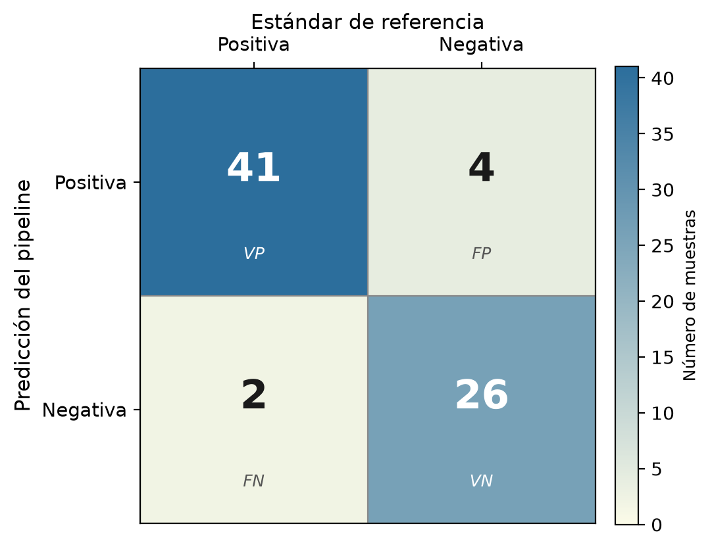
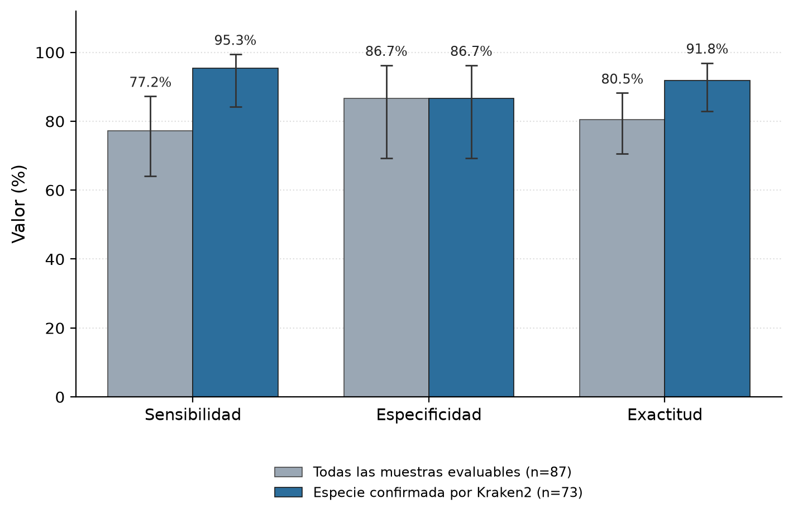
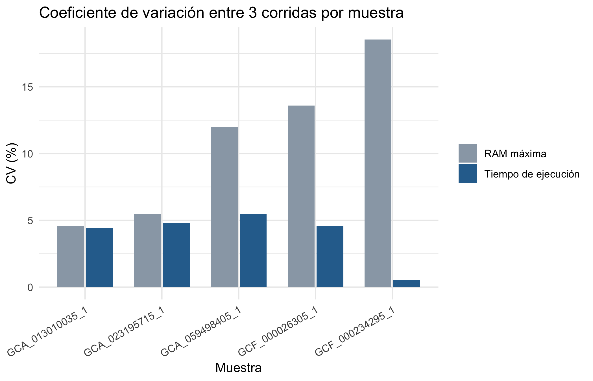

# Análisis de resultados — Validación estadística

> Documento generado a partir de los resultados del pipeline sobre el conjunto de validación. Es la versión navegable del reporte en Word (`resultados/reporte/`). Los números provienen de los artefactos que calcula `notebooks/validacion_estadistica.ipynb`; este documento no recalcula estadística.

La validación contrastó la predicción genotípica del pipeline con el estándar de referencia documentado para 92 genomas de *E. coli* obtenidos de repositorios públicos, repartidos entre controles positivos, negativos y límite (Tabla 1). El análisis examina primero la identidad real de las muestras, luego la concordancia entre predicción y referencia, y por último el origen de cada discrepancia.

**Tabla 1.** Composición del conjunto de validación por categoría de resistencia y tipo de control.

| Categoría | Especial | Negativo | Positivo |
| --- | --- | --- | --- |
| AmpC | 0 | 0 | 10 |
| CONTROL LIMITE | 5 | 0 | 0 |
| ESBL | 0 | 0 | 47 |
| NEGATIVO | 0 | 30 | 0 |

## Identidad de especie

La verificación taxonómica con Kraken2 cambió la lectura de todo el conjunto. **Catorce de los 92 genomas (15.2%) no eran *E. coli***, pese a figurar como tales en los metadatos de origen (Tabla 2). Los taxones detectados no se limitaban a parientes próximos como *Klebsiella* o *Salmonella*: aparecieron géneros tan alejados como *Listeria* y *Staphylococcus*, e incluso una secuencia de origen humano. Ninguna correspondía a los controles negativos ni a los límite; todas se habían incorporado como positivos. Su presencia hundía la sensibilidad aparente sin que mediara ningún fallo de detección, porque el gen buscado no existía en el organismo secuenciado. El análisis principal las descarta y conserva, en paralelo, el cálculo sin exclusión para dejar expuesto su efecto.

**Tabla 2.** Las 14 muestras cuya especie predominante no es *E. coli* según Kraken2.

| Accesión | Categoría | Clasificación | Taxón predominante (Kraken2) |
| --- | --- | --- | --- |
| GCA_018185615_1 | ESBL | FN | Listeria monocytogenes |
| GCA_019047325_1 | ESBL | FN | Aeromonas sp. FDAARGOS 1403 |
| GCA_036492125_1 | ESBL | FN | Listeria seeligeri |
| GCA_028391205_1 | ESBL | FN | Staphylococcus aureus |
| GCA_017392015_1 | ESBL | FN | Hoskinsella hominis |
| GCA_023195715_1 | ESBL | FN | Enterobacter roggenkampii |
| GCA_021431105_1 | ESBL | FN | Salmonella enterica |
| GCA_022819305_1 | ESBL | FN | Gordonia amicalis |
| GCA_023819205_1 | ESBL | FN | Homo sapiens |
| GCF_003176195_1 | ESBL | TP | Klebsiella quasipneumoniae |
| GCF_003175335_1 | ESBL | TP | Klebsiella variicola |
| GCA_014652315_1 | AmpC | FN | Jeongeupia sp. USM3 |
| GCA_026719305_1 | AmpC | TP | Citrobacter braakii |
| GCA_015829105_1 | AmpC | FN | Salmonella enterica |

## Concordancia entre genotipo y referencia

Sobre las 73 muestras de especie confirmada con referencia evaluable, la matriz de confusión concentra los aciertos en la diagonal: 41 verdaderos positivos y 26 verdaderos negativos, frente a 4 falsos positivos y 2 falsos negativos (Figura 1).

*__Figura 1.__ Matriz de confusión del pipeline frente al estándar de referencia sobre las 73 muestras de especie confirmada (VP: verdadero positivo; VN: verdadero negativo; FP: falso positivo; FN: falso negativo).*

La sensibilidad alcanzó el **95.3%** (IC 95%: 84.2%–99.4%) y la especificidad el **86.7%** (IC 95%: 69.3%–96.2%), con una exactitud del **91.8%** (Tabla 3). Los intervalos se calcularon por el método exacto de Clopper-Pearson. El contraste con el conjunto sin depurar es nítido: la sensibilidad caía al 77.2% y la exactitud al 80.5% (Figura 2). Esa brecha no mide un cambio en el pipeline, sino la retirada del sesgo que introducían las muestras mal identificadas.

**Tabla 3.** Métricas de desempeño con intervalo de confianza del 95% (Clopper-Pearson), con y sin exclusión taxonómica.

| Métrica | Especie confirmada (n=73) | Todas las evaluables (n=87) |
| --- | --- | --- |
| Sensibilidad | 95.3% (84.2%–99.4%) | 77.2% (64.2%–87.3%) |
| Especificidad | 86.7% (69.3%–96.2%) | 86.7% (69.3%–96.2%) |
| Exactitud | 91.8% (83.0%–96.9%) | 80.5% (70.6%–88.2%) |

*__Figura 2.__ Métricas de desempeño antes y después de excluir las muestras de otra especie. Las barras de error representan el IC del 95%.*

El índice kappa de Cohen fija la concordancia corregida por azar en **0.829 (p < 0.001)**, dentro del rango casi perfecto de la escala de Landis y Koch. Sin la depuración taxonómica descendía a 0.596, apenas moderado. La distancia entre ambos valores mide el peso de los catorce genomas espurios sobre la concordancia global.

## Casos discordantes

Los seis desacuerdos restantes admiten lectura individual (Tabla 4). Los cuatro falsos positivos aparecen todos en cepas *E. coli* negativas y comparten patrón: dos portan `blaTEM-1`, una β-lactamasa de espectro estrecho, y dos presentan mutaciones puntuales en `cirA`. Ninguno confiere por sí solo resistencia a cefalosporinas de tercera generación. El desacuerdo nace de la definición del control —ausencia de β-lactamasas de espectro extendido o AmpC adquiridas— frente a una regla de comparación que señala cualquier β-lactamasa. Es una discrepancia de criterio, no de detección. Los dos falsos negativos genuinos, confirmados como *E. coli* por MLST, no mostraron rastro del gen esperado ni por debajo de los umbrales de identidad y cobertura, y se reservan para revisión manual.

**Tabla 4.** Casos discordantes con su verificación de especie.

| Accesión | Categoría | Gen esperado | Gen detectado | Clasif. | Especie |
| --- | --- | --- | --- | --- | --- |
| GCA_018185615_1 | ESBL | blaCTX-M-15 | none | FN | otra especie |
| GCA_019047325_1 | ESBL | blaCTX-M-3 | none | FN | otra especie |
| GCA_036492125_1 | ESBL | blaCTX-M-2 | none | FN | otra especie |
| GCA_028391205_1 | ESBL | blaCTX-M-14b | none | FN | otra especie |
| GCA_017392015_1 | ESBL | blaCTX-M-8 | none | FN | otra especie |
| GCA_023195715_1 | ESBL | blaSHV-12 | none | FN | otra especie |
| GCA_024368115_1 | ESBL | blaTEM-10 | none | FN | E. coli |
| GCA_021431105_1 | ESBL | blaSHV-2 | none | FN | otra especie |
| GCA_022819305_1 | ESBL | blaSHV-18 | none | FN | otra especie |
| GCA_023819205_1 | ESBL | blaTEM-52 | none | FN | otra especie |
| GCA_014652315_1 | AmpC | blaCMY-42 | none | FN | otra especie |
| GCA_015829105_1 | AmpC | blaACC-1 | none | FN | otra especie |
| GCF_000026305_1 | NEGATIVO | none | cirA_W21Ter | FP | E. coli |
| GCF_000026325_1 | NEGATIVO | none | blaTEM-1 | FP | E. coli |
| GCF_000026345_1 | NEGATIVO | none | cirA_V239RfsTer47 | FP | E. coli |
| GCF_000010765_1 | NEGATIVO | none | blaTEM-1 | FP | E. coli |
| GCA_025819395_1 | ESBL | blaCTX-M-32 | none | FN | E. coli |

## Desempeño ante ensamblajes de calidad variable

Los cinco controles límite, escogidos por la calidad de su ensamblaje y no por su genotipo, delimitan el rango operativo del método. La cepa del brote alemán de 2011 (O104:H4 TY-2482), con el ensamblaje más fragmentado del conjunto, todavía recuperó `blaCTX-M` y `blaTEM-1`, aunque perdió la resolución del alelo exacto y del tipo de secuencia. En el extremo opuesto, la cepa de referencia EC958 —clon pandémico ST131, con ensamblaje completo— entregó los cuatro genes descritos en la literatura. Las tres muestras intermedias, una de ellas la cepa tipo de la especie, no arrojaron genes adquiridos, y ambos motores de detección coincidieron en ese resultado. El desempeño decae de forma gradual con la calidad del ensamblaje, sin quiebres abruptos.

## Reproducibilidad computacional

Cada una de las cinco muestras de control se ejecutó tres veces (Tabla 5). El tiempo de ejecución se mantuvo estable entre corridas, con un coeficiente de variación promedio del 4.0% y un máximo del 5.5%. La RAM máxima fluctuó más —CV promedio del 10.8%, hasta el 18.5% en una muestra—, porque el pico de memoria depende del paso de colocación filogenética de CheckM, sensible a la presión de memoria del sistema y a la carga concurrente del equipo durante cada corrida (Figura 3). El tiempo de cómputo del pipeline es reproducible; el consumo de memoria pico admite una variación moderada según las condiciones de ejecución.

**Tabla 5.** Media y coeficiente de variación del tiempo de ejecución y de la RAM máxima entre las tres corridas de cada muestra.

| Muestra | Tiempo medio (s) | CV tiempo (%) | RAM media (GB) | CV RAM (%) |
| --- | --- | --- | --- | --- |
| GCA_013010035_1 | 749.1 | 4.43 | 11.08 | 4.59 |
| GCA_023195715_1 | 798.9 | 4.81 | 11.64 | 5.47 |
| GCA_059498405_1 | 766.2 | 5.49 | 11.08 | 11.96 |
| GCF_000026305_1 | 860.5 | 4.55 | 10.06 | 13.6 |
| GCF_000234295_1 | 752.5 | 0.56 | 10.28 | 18.53 |

*__Figura 3.__ Coeficiente de variación del tiempo de ejecución y de la RAM máxima entre las tres corridas de cada muestra de control.*
